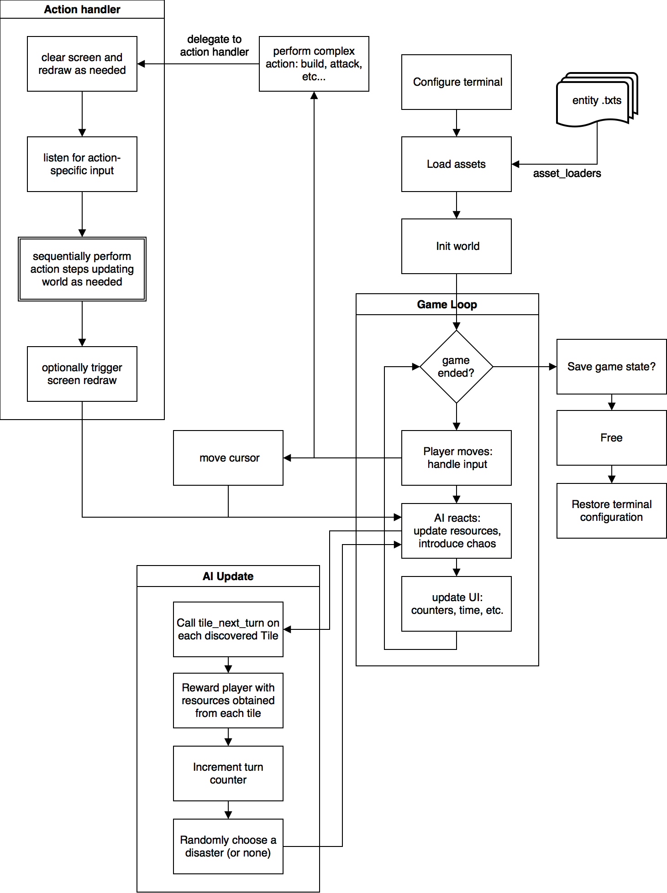

# pprog

## How to compile this project
Inside the root directory run `make`. An executable will be created inside
`build/`. You may run it with `./build/gui`. In addition, an executable with a text-only interface is avaiable in `./buil/tui` Intermediate object files (`*.o`)
will be deleted after running `make clean`, however, if by any chance one is
left behind, git is instructed to ignore them. Also, it will ignore anything
inside the build directory except for the directory itself which is required by
make. Please, do not remove `build/.keep`, it makes sure `build/` is committed
and ready to use in compilation. Finally, note that, to save time, `make` is
configured to only compile files that have changed. So do not be surprised if
you do not see a lot of commands being run when you hit `make` if you did not
change many files. If for any reason you need to start fresh, delete every
intermediate file with `make clean`.

## How to test this project
In addition to compiling, `make` is also capable of running tests. They may be
compiled and run with `make test`.

## plot proposal
Our game will be turn-based and will be set on an hexagonal grid. Your task
will be to survive as long as possible, enduring natural disasters, shortage of
resources, etc. At first, you will begin with a minimal amount of resources and
you will need to build, mine and cultivate to be able to survive to the next
round. The game ends when you run out of essential resources. In addition, we
plan on adding attack functionality with a mini game. When you choose to attack
or are attacked from an adjacent cell, the mini game will run and you will be
more or less prepared to play it depending on your available resources. Also,
the game theme is not final, and we are thinking of a more exciting topic for
our story, although the game dynamics will remain the same.

# Project architecture

We've finally settled on the following architecture:

* A game engine consisting of entities (Tile, Resource, Building and Event) that holds logic common to any turn based board game. The game engine contains both entity implementations and asset loaders that are capable of instantiating copies of entities from the data described in an asset file. That is, we do not store any information about particular entities in code, but rather store it in asset files. Each entity has it's own asset file format that is described in the interface of its asset loader. For instance, Resource asset files hold information about the resource name and id.
* A UI library that implements an interface generic enough that allows us to swap implementations as necessary. This enables using a text-based interface for testing while the graphical user interface is not ready. The interface consists of various components, mainly the Map, and two info cards, that convey information about the current state of the game. Other commands that require interactions, such as building or attacking have been defined for the text UI but their actual implementation in the GUI is yet to be designed.
* A set (or currently, just one) controllers. These files contain the logic that binds CoP commands to the actual game logic. For example: typing `b` for build will trigger a CoP command that then calls `action_build` implemented in `controller.c`. `action_build` then takes control (thereby blocking the main game loop) and triggers the drawing of the required UI modules to get or present additional information. In this case, a list of buildings to choose from would be displayed by calling the appropriate UI component. When the player has selected a building, the game engine would be told about their choice and the game state would (or would not, depending on the game logic) be updated.
* A skinny `main.c` file that is only responsible for loading the game engine, setting up the terminal and delegating to the main game loop. The main game loop just listens for keystrokes and passes them to the `CoP`. As described later, the `CoP` binds these user inputs to actual game logic through Controller `action_*` methods.

* A set of libraries that handle common tasks. Among the most important are:
    * Error Handling: exposes an interface for dealing with various types of errors, from memory allocation errors to warning or logs that we may want to include for debugging. Separating error handling into a separate library allows us to turn logs and warnings of when we're ready for deployment, or better, redirect error output to a separate log file so that it does not interfere with the interface.
    * Config. A general configuration module that loads key/value pair from a config file. These then become available throughout the game and can be accessed by using the interface described in `src/lib/config.h`.
    * Sprite. A general purpose UI library, built ad-hoc for this project. We're capable of printing PNGs to the terminal. These images do not require special preprocessing – almost any image downloaded from the internet will suffice. This is the basis for our UI module.
    * The Command Processor. Responsible for binding user keystrokes to actual commands that implement game logic, the CoP is the central module that hands off control to more specific parts of the game.

## So where's everything

* `lib` contains third party libraries such as `lineread`.
* `assets/` contains entity databases and general game assets.
* `src/` contains all the code that we wrote for the game:
    * `src/asset_loaders` contains the code for loading assets into entities;
    * `src/entities` contains the core of the game engine: Tile, Building, Resource, etc...
    * `src/lib` contains small libraries that we wrote ourselves to handle repetitive tasks. Error Handling, Config and Sprite, among others, live here;
    * `src/gui` and `src/tui` contain the implementations for both graphical and text based user interfaces. These files are linked to their respective executables. In addition, a different main file `gui.c` or `tui.c` is used to generate each executable separately.
    * `src/` contains the `ui` and controller modules, which will likely be moved into their own subdirectories soon.
* `test/` contains spec files for entities, asset_loaders and some libraries. Basically we tested everything that could be uint tested easily.
* `build/` is where executables are generated. This directory must not be removed (don't remove `build/.keep`, or otherwise Git will get rid of it)
